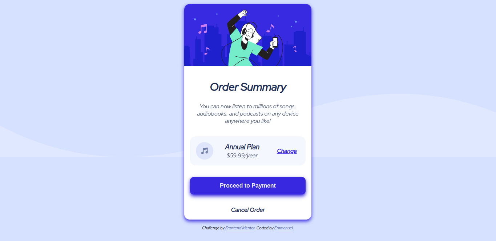

# Frontend Mentor - Order summary card solution

This is a solution to the [Order summary card challenge on Frontend Mentor](https://www.frontendmentor.io/challenges/order-summary-component-QlPmajDUj). Frontend Mentor challenges help you improve your coding skills by building realistic projects. 

## Table of contents

- [Overview](#overview)
  - [The challenge](#the-challenge)
  - [Screenshot](#screenshot)
  - [Links](#links)
- [My process](#my-process)
  - [Built with](#built-with)
  - [What I learned](#what-i-learned)
  - [Continued development](#continued-development)
- [Author](#author)


## Overview
This is a newbie level challenge. And it took me about 3 hours from start to completion
It did not have a lot of work since there's not much going in terms of switching from mobile-design to desktop-design
The challenge was to try an build out the following designs and get yours looking as close as possible to the given designs


### The challenge

Users should be able to:

- See hover states for interactive elements

### Screenshot
My Solutions



### Links

- Solution URL: [GitHub](https://github.com/munyite001/Order-Summary-Card)
- Live Site URL: [Netlify](https://order-summary-card-f-mentor.netlify.app/)

## My process
I was working with the mobile first workflow, so I started with the mobile design, then worked my way up changing to the desktop design on larger screens

### Built with

- Semantic HTML5 markup
- CSS custom properties
- Flexbox
- Mobile-first workflow

### What I learned

Well for one, it is always good to first analyze the design, break it into sections or boxes, then see how those boxes would look like in the mobile design, and how they would shift when moving to the desktop design.
A good practice while building out your designs, is to add colored borders on every div, so that it can be easier to know how each div behaves in different circumstances

```css
div{
  border: 1px solid blueviolet;
}
```

### Continued development

I want to continue working on the mobile first workflow, and also to improve on media queries so that I can capture not just one but multiple screens and devices

## Author

- Github - [](https://github.com/munyite001)
- Frontend Mentor - [@munyite001](https://www.frontendmentor.io/profile/munyite001)
- Twitter - [@emunyite](https://www.twitter.com/emunyite)

